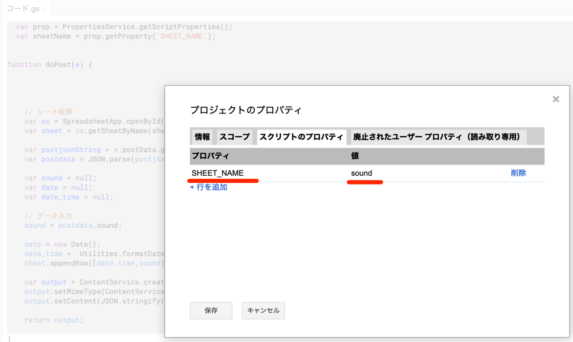
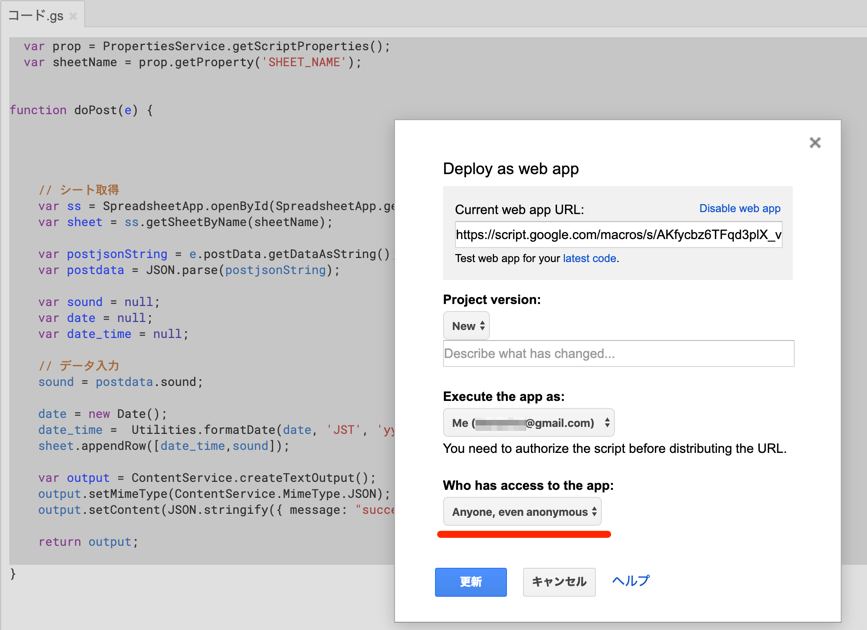
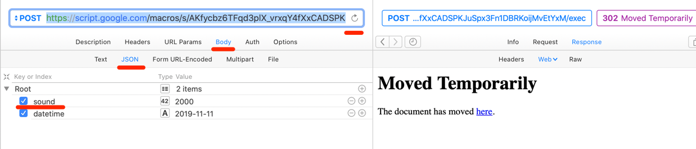

# 使い方

1. 新しいGoogle sheetを作成します
2. シート名を適宜変更します
3. 1行目のA列に datetime, B列に sound と入力します
4. ツール＞スクリプトエディタを選択し、M5Stack-sound-googlespreadsheet.gasをペーストします。
5. SHEET_NAMEのプロパティを利用しているので、プロジェクトのプロパティで、ユーザー設定プロパティ値を設定します。SHEET_NAME: sound

6. デプロイします。doPostを叩くため、"Anyone, even anonymous"を選びます

6. PAWなどからjson形式で叩いてみます。bodyにjsonを選んで、soundのkeyと任意のvalueを記入します

302が出たら、シート側を見ると値が書かれてるはずです。

7. M5Stack FireをつないだArduino IDEに、m5stack-sound-https-post-gsheet.inoをセットします。
WiFiの情報を書く部分があるので、記入します。11aにはM5Stackが対応してないので、2.4GHz帯の11nなどを選んでください

8. 書き込みが成功すれば、M5Stack Fire Analog 34pinの数値が10秒おきにgoogle sheetに書かれます。

### 次のステップ

M5Stack Fireのマイクロフォンの信号は、サンプリングやFFTなどの処理をする必要があります。

https://ambidata.io/samples/m5stack/sound/